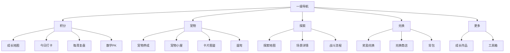

# 首页 Tab 重构设计稿（积分 / 宠物 / 探索优先）

> **ID**：`DESIGN-2026-06-29-03`
>
> **状态**：待实施
>
> **目标**：把当前 11 个平铺入口收敛为 5 个一级 tab，让首页优先服务“积分、宠物、探索”三条主线，同时把低频能力合并到 `兑换` 和 `更多` 中，降低首屏认知负担，但不删除任何现有功能页。

---

## 1. 背景

当前首页一级导航仍是“功能大拼盘”：

- `成长地图`
- `今日打卡`
- `每周复盘`
- `奖励兑换`
- `成长作品`
- `宠物养成`
- `宠物小屋`
- `探索冒险`
- `数学PK`
- `背包`
- `卡片图鉴`
- `兑换商店`
- `工具箱`

这套结构的问题不是“功能不够”，而是**优先级不对**：

1. 对家长/孩子来说，进入产品后的第一目标是“看积分、看宠物、去探索”，不是先在 11 个入口里找路。
2. `奖励兑换 / 兑换商店 / 背包` 属于同一类“消费与资产管理”，不该并排占用多个一级位。
3. `成长作品 / 工具箱` 都是低频能力，应该收进“更多”，而不是占用主导航。
4. `成长地图` 更像默认落地页，不是必须独立作为一级入口存在的核心业务。

参考输入：

- [UI 和场景参考](../原始需求/UI和场景参考.md)
- [banchong 宠物互动分析与合入方案](./banchong宠物互动分析与合入方案.md)
- [需求规格书](../规格/需求规格书.md)
- [差距清单与开发路线图](../路线/差距清单与开发路线图.md)

---

## 2. 设计原则

### 2.1 主线优先

一级 tab 只保留真正高频、长期会反复进入的四类：积分、宠物、探索、兑换，再加一个承载低频能力的“更多”。

### 2.2 相近目标合并

目标一致的页面放在同一 tab 下，减少用户判断成本：

- “看积分”和“做积分”放一起
- “养宠物”和“看宠物状态”放一起
- “花积分”和“管理已获得资产”放一起
- “作品展示”和“工具”放一起

### 2.3 保留现有页面

本轮不删页面、不改业务模块边界，只做导航收口和首页内容重排。现有 `switchPage('xxx')` 仍然保留，避免把导航重构变成业务重构。

### 2.4 默认落地页要像首页

用户打开应用后看到的第一屏，应该是“总览 + 快捷入口”，而不是某个功能页的裸表单。

---

## 3. 一级 Tab 方案

### 3.1 推荐顺序

1. `积分`
2. `宠物`
3. `探索`
4. `兑换`
5. `更多`

### 3.2 每个 tab 收什么

| 一级 tab | 默认落地页 | 收纳页面 | 设计理由 |
|---|---|---|---|
| `积分` | `map` | `today` / `review` / `mathpk` | 都是积分来源与积分总览，应该是最靠前的主线 |
| `宠物` | `pet` | `home` / `card` / `walk` | 都围绕同一只宠物及其日常陪伴，不该拆散 |
| `探索` | `explore` | `exploration-detail`（内部流程，不单独做一级） | 独立主循环，保留单独入口最清晰 |
| `兑换` | `reward` | `shop` / `inventory` | 都属于积分消费与资产管理，用户心智一致 |
| `更多` | `works` | `tools` | 低频功能合并收口，减少一级位占用 |

### 3.3 为什么这样合并

- `奖励兑换 + 兑换商店 + 背包` 其实都在回答“怎么花、怎么管已拿到的东西”，适合合并到 `兑换`。
- `宠物养成 + 宠物小屋 + 卡片图鉴 + 遛弯` 都是同一条“陪伴宠物”的扩展能力，适合合并到 `宠物`。
- `成长作品 + 工具箱` 都不是主循环的高频动作，适合放在 `更多`。
- `数学PK` 是积分来源，不应该单独占一级 tab。

---

## 4. 首页首屏布局

### 4.1 默认首页

默认进入 `积分`，但视觉上仍保留 `成长地图` 的首页气质。

### 4.2 首屏结构

建议首页首屏分成三层：

1. 顶部信息条
2. 主入口卡片区
3. 次级入口卡片区

### 4.3 首屏卡片优先级

**主卡片**

- `今日打卡`
- `宠物`
- `探索`

**次卡片**

- `兑换`
- `更多`

这 5 张卡片足够支撑首页日常使用，不需要把 11 个入口全平铺出来。

### 4.4 视觉建议

- 主卡片更大、更亮、更具体，适合快速点击。
- 次卡片更小、更轻，强调“还有别的能力”。
- `成长地图` 可以保留为首页背景层或大标题，而不是一级 tab 名称。

---

## 5. 信息架构

---

## 6. 实施策略

### 6.1 不改业务，只改导航

保留现有叶子页和模块逻辑，先做“入口收口”：

- 一级 tab 变少
- 二级入口用页面内卡片承接
- `switchPage('xxx')` 继续保留

### 6.2 建议的实现方式

1. `index.html` 里把顶部导航改成 5 个主 tab。
2. `js/app.js` 里增加“一级 tab -> 默认落地页”的映射。
3. `page-map`、`page-pet`、`page-reward`、`page-works` 改成各自的 hub 页面。
4. 各 hub 页面内保留现有 leaf 页按钮，避免用户找不到原功能。

### 6.3 推荐的路由映射

| 主 tab | 默认打开页 | 现有 leaf 页面按钮 |
|---|---|---|
| `积分` | `map` | `today` / `review` / `mathpk` |
| `宠物` | `pet` | `home` / `card` / `walk` |
| `探索` | `explore` | 内部流程，不拆一级 |
| `兑换` | `reward` | `shop` / `inventory` |
| `更多` | `works` | `tools` |

---

## 7. 文件影响

| 文件 | 作用 |
|---|---|
| `index.html` | 重排顶部导航，调整首页卡片入口 |
| `js/app.js` | 增加主 tab 映射、active 状态同步、默认落地页逻辑 |
| `css/style.css` | 主 tab 样式、hub 页面卡片样式、移动端横向滚动 |
| `docs/plans/README.md` | 补充本设计稿与对应实施计划索引 |

---

## 8. 验收标准

1. 顶部一级 tab 固定为 5 个：`积分 / 宠物 / 探索 / 兑换 / 更多`。
2. `积分` 排在最前，且作为默认落地页。
3. `宠物` 能进入宠物养成、小屋、图鉴、遛弯。
4. `兑换` 能进入奖励兑换、兑换商店、背包。
5. `更多` 能进入成长作品、工具箱。
6. `数学PK` 不再占一级 tab，但仍可从 `积分` 进入。
7. 手机端不出现 11 个 tab 横向挤爆或多行杂乱。
8. 所有现有 leaf 页面仍可通过按钮进入，不丢功能。

---

## 9. 明确不做

- 不做自定义拖拽排序
- 不做按用户身份隐藏 tab
- 不做后端路由改造
- 不删除现有 leaf 页面
- 不把导航重构变成业务重写

---

## 10. 一句话结论

**把首页从“功能列表”改成“主线入口”，把 `积分 / 宠物 / 探索` 放前面，把 `兑换 / 更多` 收后面，保留所有现有功能页，但只让用户先看见最该看的 5 个入口。**
