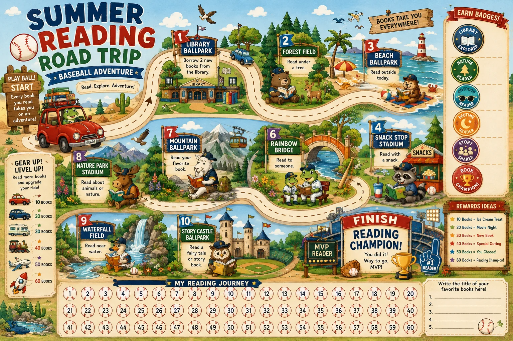
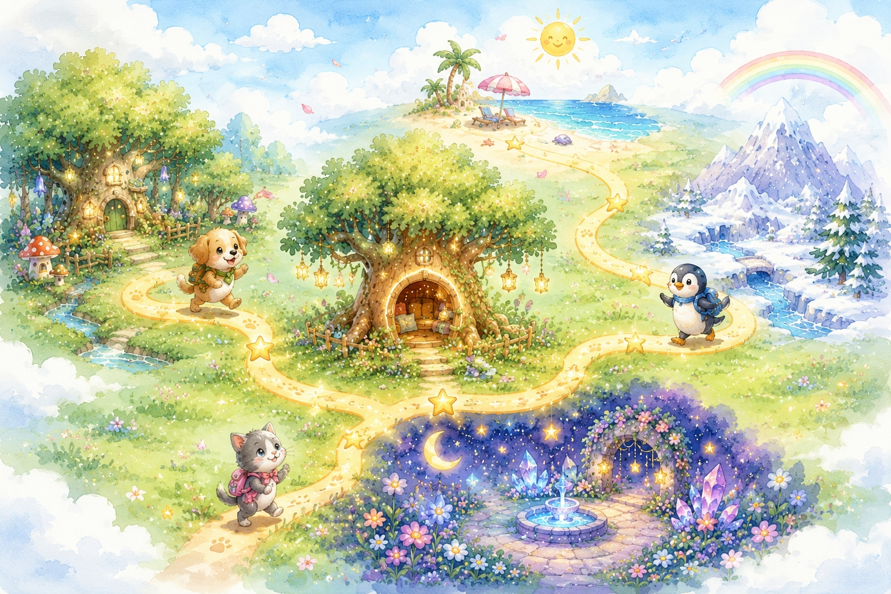

UI和场景参考


我觉得整个网页设计可以更有趣一点，参考这个图，用GPT-IMAGE生成首页的背景图，有几个栏目可以点进去。你分析可行吗？




*可行方案：GPT-Image-2 生成背景 + HTML 叠加可点击区域** | 方面 | 评估 | |------|------| | **背景图生成** | ✅ 水彩绘本风格 GPT-Image-2 验证过，质量顶级 | | **整体大地图** | ⚠️ 可行但定位麻烦——一张大图上精确对齐HTML按钮容易因屏幕尺寸偏移 | | **分区域生成** | ✅ **推荐**——每个区域独立生成场景图，用CSS拼成地图，天然支持点击 | **推荐实现方案：** ``` ┌─────────────────────────────┐ │  首页大标题 + 积分/等级条    │ ├─────────────────────────────┤ │                             │ │  🌲森林   🏖️海滩   🏔️雪山  │  ← 3个独立场景卡片 │  探索冒险   海滩寻宝  攀登挑战 │     每张用GPT-Image-2生成 │                             │     点击跳转对应功能 ├─────────────────────────────┤ │  🍬糖果   🚀太空   🏰城堡  │  ← 解锁更多场景 │  (🔒需积分)  (🔒需积分)  (🔒) │ ├─────────────────────────────┤ │  🏆 今日任务  📦 背包  🃏图鉴 │  ← 快捷入口按钮 └─────────────────────────────┘ ``` **关键决策：** 1. **场景图**：每个 ~400KB webp，12张共 ~5MB，可接受 2. **交互层**：场景图作为卡片背景，上面叠加半透明遮罩 + 文字/按钮 3. **解锁机制**：积分解锁新场景（锁定的显示灰色占位图） 要开始做吗？我先批量生成12张场景插画（~10分钟），然后改造首页UI。


根据 Pet-Bank 的场景和风格，给你几个提示词选项： ## 推荐提示词（DALL-E 3 / GPT-4o）


