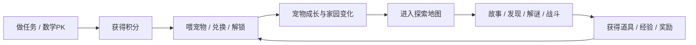

# 世界观与主线

> **关键词**：积分、宠物、探索、兑换、回家。
>
> 世界观不需要写得很重，但要足够统一，让所有模块看起来属于同一个世界。

---

## 1. 世界观基底

这是一个“成长空间站 / 宠物乐园 / 任务地图”混合体。

孩子在这里做任务获得积分，宠物靠积分与照料成长，探索地图能获得材料、经验与事件反馈，兑换把成果重新带回家园。

---

## 2. 主线循环

这个循环要一直成立。

---

## 3. 叙事驱动点

### 3.1 积分

积分不是纯数字，而是“我今天完成了多少成长动作”的证据。

### 3.2 宠物

宠物是情感中心，负责把抽象积分变成可见反馈。

### 3.3 探索

探索是情绪出口，负责把重复的成长动作变成“今天出去冒险一下”的感觉。

### 3.4 兑换

兑换是结果回流，负责让奖励重新回到宠物和小屋里。

---

## 4. 故事语言风格

- 轻童话
- 轻冒险
- 轻幽默
- 低压力
- 正向鼓励

不要写成很长的史诗，也不要写成成人向复杂剧情。

---

## 5. 主线节奏

建议的节奏是：

1. 进入世界，看到地图
2. 选择一个场景
3. 遇到一段旁白
4. 看到一个发现点
5. 遇到一个小选择或数学谜题
6. 触发战斗或奖励
7. 带着成果回家

