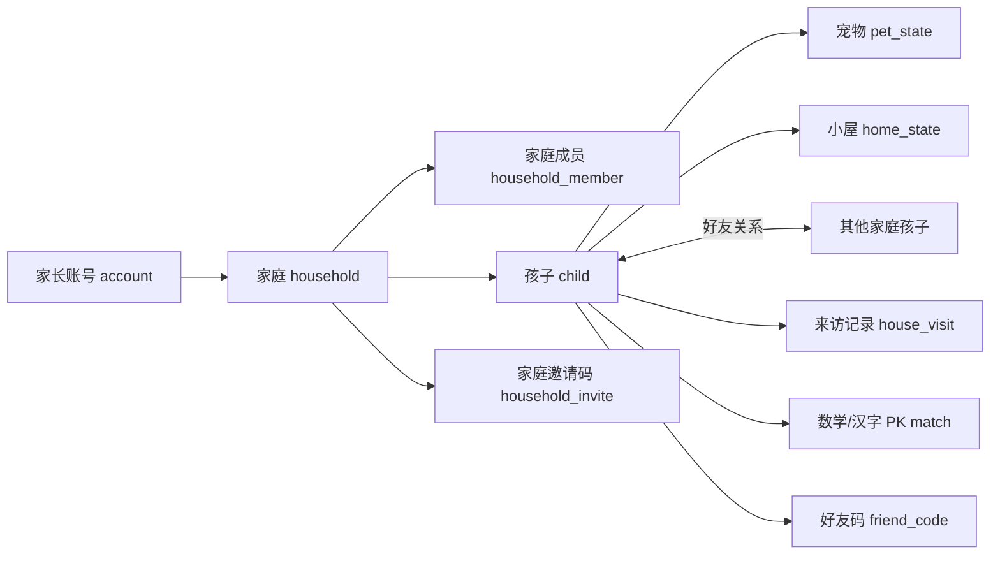

# 家庭账号社交体系数据模型与权限

## 1. 总体关系图

---

## 2. 推荐实体清单

### 2.1 账号与身份

| 实体 | 关键字段 | 说明 |
|---|---|---|
| `account_profiles` | `account_id`, `display_name`, `avatar_url`, `primary_contact` | 家长账号资料，通常与 Auth 用户一一对应 |
| `households` | `id`, `name`, `owner_account_id`, `created_at` | 家庭空间，是主要数据归属容器 |
| `household_members` | `household_id`, `account_id`, `role`, `status` | 账号与家庭的多对多关系，支持主账号与协作家长 |
| `user_roles` | `account_id`, `role`, `granted_by_account_id`, `granted_at` | 平台级角色映射；当前轻后台先只保留 `admin` |
| `admin_audit_logs` | `actor_account_id`, `action_type`, `target_type`, `target_id`, `payload_json` | 管理员操作审计，记录谁对什么对象做了什么动作 |

### 2.2 孩子与宠物

| 实体 | 关键字段 | 说明 |
|---|---|---|
| `children` | `id`, `household_id`, `name`, `avatar`, `birth_year`, `status` | 孩子实体，是养成和社交主体 |
| `child_pet_state` | `child_id`, `pet_species_id`, `level`, `exp`, `stage`, `stats_json` | 宠物基础成长状态 |
| `child_home_state` | `child_id`, `theme_id`, `furniture_json`, `visit_access` | 小屋主题、摆设与可见范围 |
| `child_game_state` | `child_id`, `points`, `inventory_json`, `explore_json`, `hanzi_progress_json` | 当前本地散落在多个 `petbank_*` 键中的进度，可分阶段拆表 |

### 2.3 邀请与关系

| 实体 | 关键字段 | 说明 |
|---|---|---|
| `registration_invites` | `code`, `campaign`, `expires_at`, `max_uses` | 注册邀请码，控制拉新或测试资格 |
| `household_invites` | `code`, `household_id`, `role_to_grant`, `expires_at`, `status` | 家庭邀请码，邀请另一位家长加入同一家庭 |
| `child_friend_codes` | `code`, `child_id`, `expires_at`, `status` | 孩子好友码，用于跨家庭加好友 |
| `child_friendships` | `child_id`, `friend_child_id`, `status`, `created_at` | 双向好友关系 |

### 2.4 互动与 PK

| 实体 | 关键字段 | 说明 |
|---|---|---|
| `house_visits` | `id`, `from_child_id`, `to_child_id`, `action_type`, `message`, `created_at` | 串门、打招呼、一起玩、留足迹等 |
| `gift_events` | `id`, `from_child_id`, `to_child_id`, `item_id`, `created_at` | 送礼行为，可独立也可并入来访表 |
| `pk_matches` | `id`, `game_type`, `question_set_id`, `challenger_child_id`, `opponent_child_id`, `status`, `expires_at` | 一场数学/汉字 PK 的壳 |
| `pk_question_sets` | `id`, `game_type`, `payload_json`, `difficulty`, `seed` | 冻结题组，保证双方同题 |
| `pk_attempts` | `match_id`, `child_id`, `score`, `correct_count`, `duration_ms`, `submitted_at`, `detail_json` | 某个孩子对这场 PK 的作答记录 |
| `activity_feed` | `household_id`, `child_id`, `event_type`, `summary`, `payload_json` | 家庭内动态与提醒流 |

---

## 3. 推荐关系边界

### 3.1 家庭是归属层

下面这些都应以家庭为根：

- 家长成员
- 孩子
- 家庭级设置
- 家庭邀请码

### 3.2 孩子是社交层

下面这些都应以孩子为根：

- 宠物
- 小屋
- 好友关系
- 来访记录
- PK

### 3.3 为什么不把好友关系挂在家庭上

因为真正互动的是“孩子的宠物”和“孩子的挑战结果”，不是整个家庭作为一个账号去对另一个家庭。

把好友关系挂在孩子层，会更自然：

- 二宝可以和别人家的大宝是好友
- 同一家庭两个孩子可以有不同社交圈
- 后续做孩子榜单、好友亲密度更顺

---

## 4. 权限矩阵

| 操作 | `owner` | `guardian` | `friend` | `guest` |
|---|---|---|---|---|
| 查看家庭信息 | 是 | 是 | 否 | 否 |
| 邀请家长加入家庭 | 是 | 否 | 否 | 否 |
| 新增/删除孩子 | 是 | 可配置 | 否 | 否 |
| 操作本家庭孩子养成 | 是 | 是 | 否 | 否 |
| 查看好友开放小屋 | 否 | 否 | 是 | 否 |
| 给好友孩子留言/来访 | 否 | 否 | 是 | 否 |
| 发起/接受好友 PK | 否 | 否 | 是 | 否 |
| 查看完整成长隐私数据 | 是 | 是 | 否 | 否 |

### 4.1 好友只看“开放表面”

好友不应该直接看到：

- 完整积分账本
- 家庭成员信息
- 手机号或账号信息
- 全量背包与历史记录

好友能看到的应是：

- 孩子昵称
- 宠物外观
- 小屋公开面
- 来访可见内容
- PK 结果摘要

这意味着前端不适合直接把 `child_profiles` 当“好友页查询表”来读。更稳的做法是额外提供一层 **受控社交资料读取**：

- 总是允许返回昵称、头像、基础可见性
- 只有 `home_visibility = friends` 时，才返回小屋 / 宠物摘要
- 家庭成员仍然可以看到完整孩子摘要
- 社交页、串门记录、PK 结果页都复用这一层，而不是各自拼权限

---

## 5. 隐私与可见性设置

建议在 `child_home_state` 或独立设置表中增加这些开关：

| 字段 | 值 | 含义 |
|---|---|---|
| `visit_access` | `private / friends_only / invite_only` | 谁能串门 |
| `pk_access` | `private / friends_only` | 谁能向我发起 PK |
| `show_growth_summary` | `true/false` | 是否公开等级/成长摘要 |
| `allow_gift_receive` | `true/false` | 是否允许接收好友礼物 |

当前仓库实现里，`visit_access` / `pk_access` 已直接落在 `child_profiles` 云端表上：

- `private`：仅同一家庭下的孩子可串门 / 发起 PK
- `friends`：同家庭孩子 + 已建立好友关系的外部孩子可访问

---

## 6. 与现有 localStorage 的映射

当前仓库里有两层本地数据基础：

1. 业务键：`petbank_*`
2. 多孩子快照层：`petbank_profiles_meta` / `petbank_active_profile` / `petbank_profile_data_{id}`

### 6.1 推荐导入思路

首次家长登录并创建家庭后：

1. 读取 `petbank_profiles_meta`
2. 对每个本地 profile 创建一个 `child`
3. 把对应 `petbank_profile_data_{id}` 快照解析为该孩子的初始状态
4. 若只有当前业务键、没有 profile 快照，则将当前业务键导入为默认孩子

### 6.2 导入优先级

| 来源 | 优先级 | 用途 |
|---|---|---|
| `petbank_profile_data_{id}` | 最高 | 已切分好的孩子档案 |
| 当前 `petbank_*` 业务键 | 次高 | 老用户单档导入 |
| 云端已有 child state | 最高于本地 | 登录后恢复正式真源 |

### 6.3 导入策略建议

- 首次登录时提示“是否把本机孩子档案导入到云端家庭”
- 导入是一次性明确动作，不做静默覆盖
- 导入完成后，本地保留缓存，但以云端为真源

---

## 7. 技术实现建议

### 7.1 数据库层

建议用 Postgres 表达这些关系，因为这里存在大量：

- 一对多
- 多对多
- 带状态的邀请关系
- 带有效期的码
- 带结算规则的 PK

这类结构天然更适合关系型模型。

### 7.2 权限层

建议用 RLS 保护：

- 只有本家庭成员能查家庭和孩子详细数据
- 只有好友关系成立后，才能查好友开放数据
- 只有邀请码有效时，才能完成加入

### 7.3 服务层

以下行为不建议完全裸 SQL 暴露给前端：

- 接受家庭邀请
- 兑换好友码
- 创建 PK 并冻结题组
- 结算 PK 结果

这些更适合放到 Edge Function 或受控 RPC 中完成。

---

## 8. 风险点

### 8.1 本地与云端双写冲突

如果未来保留本地缓存，就必须明确：

- 谁是真源
- 登录后谁覆盖谁
- 离线写入何时回传

推荐规则：

- 登录态下：云端是真源
- 离线时：本地只做临时缓存
- 恢复网络后：走明确同步流程，不做隐式全自动合并

### 8.2 同一孩子被多个家长同时操作

这是家庭协作必然出现的问题。

建议先接受“最后写入生效”，并配合：

- `updated_at`
- 操作日志
- 关键动作轻提醒

不要在第一版就上复杂冲突合并。

### 8.3 未成年人数据

虽然系统主体是家长账号，但业务对象是孩子。

因此要避免把以下信息暴露给好友家庭：

- 真实姓名全量
- 手机号
- 完整历史记录
- 家庭成员资料

---

## 9. 结论

数据模型上，这次升级最重要的不是“给当前表加几个字段”，而是把系统结构明确成三层：

1. **身份层**：家长账号
2. **归属层**：家庭
3. **互动层**：孩子 / 宠物 / 好友 / PK

只要这三层站稳，后面的串门、礼物、数学 PK、汉字 PK 都会顺很多。
