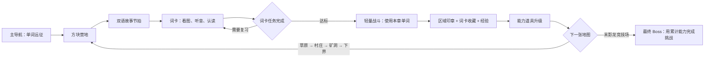

# Minecraft 单词远征完整网页方案

> 状态：2026-07-19 方案基线
>
> 适用范围：当前 Vanilla JS 静态 SPA 的 `minecraft-vocab` 学习页，以及它在学习中心、今日页和 Pages 制品中的入口。

## 1. 目标

把现有的 Minecraft 单词远征做成一个可直接使用、可恢复、可验证的孩子学习网页：孩子进入后能理解今天要做什么，能够在 10 分钟左右完成一条 11 张词卡路线，也能继续推进五个地图章节；学习结果按当前 Profile 隔离，重复操作不重复发奖，页面在桌面和窄屏上都能操作。

本次交付以现有代码为事实来源。当前词卡数据、双语故事、远征地图、音频、UI 素材、运行分片和发布契约已经存在或正在工作树中生成；本方案不重新引入 Supabase，不创建第二套积分账本，不把独立原型当成主站页面。

## 2. 产品形式

页面采用“学习工作台 + 远征地图”的混合形式：

- 顶部是稳定的返回、页面标题和今日进度，不让孩子迷失在深层页面。
- 首页左侧是今日学习进度和四个阶段，主区域是带伙伴的远征入口、级别/词库选择、下一张词卡预览和营地地图。
- 会话按 `复习热身 → 新词输入 → 主动回忆 → 场景句` 组织 11 个任务；词卡支持真实图片、单词/短语/例句音频、翻面、提示、选择题或自评。
- 地图章节先讲三段双语故事，再进入仅绑定本章词卡的学习队列；完成后进入节点战斗，战斗胜利点亮区域并解锁下一章。
- 完成页明确展示奖励、经验、收集物和返回路径；奖励失败显示可重试状态，不假装成功。

视觉方向采用“明亮像素冒险 + 学习工作台”：绿色草地、蓝色水域、橙色任务强调、白色内容面板；像素素材只负责建立世界感，正文和答案控件保持高对比和清晰层级。动效只用于当前任务/奖励反馈，并遵守 `prefers-reduced-motion`。图标使用现有 Lucide 集成，不用 emoji 充当按钮图标。

### 远征主循环示意

远征的核心闭环是“故事给目标、词卡给能力、战斗给反馈、地图给长期目标”。幼儿园和小学低年级默认每章只要求少量目标词；重复练习会增加熟练度与远征经验，而不是用失败扣除孩子已有成果。

### Grok 视觉参考

以下是已生成并纳入运行时清单的参考图，正文 UI 仍使用 HTML/CSS 文字和控件保证可读性：

对应的生成提示词保存在 `assets/learn/english-vocab/generated/minecraft-expedition/prompts/`，仅用于素材追溯；提示词、`docs/` 和临时文件不会进入 Pages 制品。

## 3. 现有能力与本次收口

### 已有并保留

- `js/minecraft-vocab-page.js`：页面渲染、首页、会话、故事、战斗、完成页和事件绑定。
- `js/minecraft-vocab-session.js`：按本地日期和 Profile 生成/恢复 11 张队列，记录完成和奖励事件。
- `js/minecraft-vocab-expedition.js`：按 Profile 保存区域状态、词卡经验、等级、道具、能力和章节解锁。
- `js/minecraft-vocab-levels.js`、`js/minecraft-vocab-loader.js`、`js/minecraft-vocab-audio.js`：分级、运行数据加载、音频 URL。
- `js/english-vocab-progress.js`、`GameRewardReceipts`、`PetBankPoints`：学习进度和统一奖励边界。
- `data/learn/minecraft-expedition/camp-regions.json`：五区域连通路线、双语故事、章节词卡、战斗和奖励。
- `css/minecraft-vocab.css` 与 `assets/learn/english-vocab/generated/`：页面布局和视觉素材。

### 本次必须验证/收口

1. 真实浏览器页面能够从学习中心或今日页进入，运行分片只加载必要数据。
2. 首页、会话、故事、战斗和完成页均无 JS 页面错误、无图片空白、无移动端横向溢出。
3. 级别和 Minecraft 内部词库选择按 Profile 保存，切换后地图锁定状态和队列数据一致。
4. 普通今日会话和区域章节会话都能完整结束；完成一次只产生一个稳定奖励事件。
5. 地图五区域可以按前置关系逐章推进，战斗使用已获得能力，完成后保留收集物和经验。
6. Pages 制品只包含允许发布的入口、数据、运行分片和素材，深层 URL 仍能通过资源基址工作。
7. 文档明确区分当前实现、历史残留和未实现的通用多端合并能力；词卡进度与 review events 已有安全的专用自动合并。

## 4. 数据与生命周期边界

- 学习进度使用现有 `EnglishVocabProgress` 的 Profile 作用域键；远征状态使用 `petbank_minecraft_expedition_state_v2_{profileId}`；会话使用 `petbank_minecraft_vocab_session_v1_{profileId}`。
- 级别和 Minecraft 词库选择使用现有 `petbank_minecraft_vocab_level_v1_{profileId}`、`petbank_minecraft_vocab_band_v1_{profileId}`，不迁移家长账号、访问令牌或其他设备配置。
- 日身份使用 `MinecraftVocabSession` 的本地日期，不在页面层新增日期算法。
- 词卡掌握先通过英语词汇进度 API 写入，再由远征状态记录可接受动作，最后由统一 receipt 发积分；任何持久化失败都保留失败状态并允许重试。
- 页面重新渲染或切页时使用现有 generation/selection request 保护，不能让旧的异步数据覆盖新 Profile 或新选择。
- 资源读取都要检查 `response.ok`，经过 `PetBankRuntime.resolveAssetUrl`；图片/音频失败要有明确 fallback 或禁用状态。

## 5. 交互验收

### 桌面

- 1280px 宽页面内容保持在约 1160px 内，首页同时显示进度栏和学习主区。
- 会话优先突出当前词卡，进度面板可展开，不与主学习区竞争焦点。
- 故事页能扫描章节目标、三段故事和目标词卡，然后进入本章学习。

### 移动端

- 320/375/390px 宽度无横向溢出；卡片正反面单列显示。
- 会话底部操作栏贴合安全区，按钮文本不被截断，焦点环可见。
- 图片使用稳定尺寸和 `object-fit: contain`，加载失败不把布局撑坏。

### 无障碍与反馈

- 每个图标按钮有 `aria-label` 或可见文字；图片有替代文本。
- 翻卡可通过键盘触发，答案输入支持 Enter；选择项使用可读的按钮语义。
- 反馈使用 `aria-live`，错误和奖励重试状态可见。
- 减少动效时不依赖动画完成业务结算。

## 6. 验证策略

先跑无浏览器契约和数据测试，再启动 `node scripts/local-server.mjs` 跑：

- `test-minecraft-vocab-browser.mjs`：学习中心入口、首页、分级、会话、词卡、奖励、移动端。
- `test-minecraft-expedition-browser.mjs`：五区域故事、绑定词卡、战斗解锁和最终收集。
- `test-pages-vocab-publish-contract.mjs`、`test-static-route-entries.mjs`、`test-pages-fast-gate-contract.mjs`：发布制品和深层路由。
- `node scripts/run-full-regression.mjs`：全站回归；若环境依赖导致失败，报告具体环境项和业务断言，不把环境失败写成通过。

## 7. 明确不在本次范围

- 不迁移到 React、Tailwind 或 ES modules。
- 不重新创建 Supabase 运行时。
- 不新增云端协议；复用现有离线 outbox 和 revision 快照。词卡进度/review events 的安全合并已实现，积分、宠物和奖励等非词卡冲突仍走家长端人工处理。
- 不删除工作树里已有的生成素材、音频、词卡分片或未提交文件。
- 不把现有独立小游戏原型重写成远征页内部玩法。

## 8. 完成定义

当方案中的页面路径、存储隔离、奖励幂等、地图推进、资源 fallback、移动端布局和 Pages 制品均有新鲜测试输出为证，且没有未解释的浏览器 page error 或关键资源失败，才报告网站完成。文档与代码若有行号漂移，以当前代码和实际测试入口为准，并在交付说明中列出漂移。
